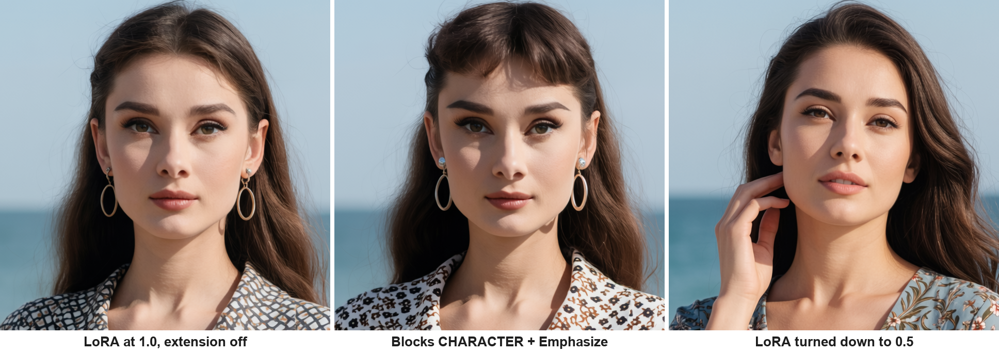
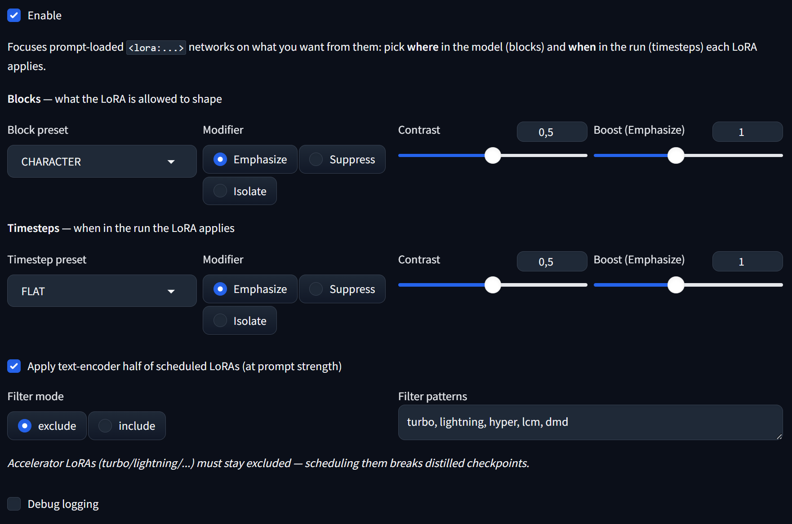
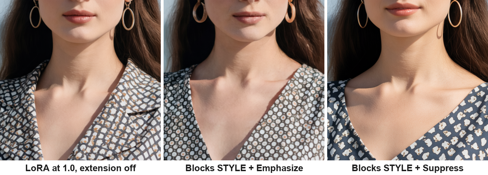

# Neo-LoraCtl

Fine control over where and when your LoRAs act, for Stable Diffusion WebUI Forge Neo.

A LoRA rarely does just one thing. A character LoRA carries the face you want, and along with it the rendering style, the grain and the color cast of its training set. A style LoRA carries the look you want, and along with it distorted faces. The usual fix is lowering the LoRA strength, and it fails: turn the strength down far enough to remove the unwanted part and the part you wanted is gone too.

Neo-LoraCtl takes a different approach. Instead of one strength for the whole LoRA, it shapes the strength across two dimensions: across the model's blocks (which parts of the image generation the LoRA is allowed to influence) and across the sampling steps (when during generation it applies). You pick a preset on either axis, choose whether to emphasize or suppress that zone, and set how strongly. No number grids, no per-block spreadsheets.

Built and calibrated for Krea 2 first. SD 1.5, SDXL and Flux checkpoints are supported on a best effort basis. Unknown architectures degrade gracefully: timestep control keeps working, block control switches off.

Here is the problem and the solution in one strip. Left: a character LoRA at full strength gives a good likeness, together with everything else it drags in. Right: the usual fix, lowering the LoRA to 0.5, loses the face entirely. Middle: Neo-LoraCtl with blocks CHARACTER + Emphasize keeps the LoRA at full strength where the identity lives and trims it elsewhere. The likeness is as good as at full strength, arguably better.

## Installation

Copy or clone this folder into `extensions/` inside your Forge Neo install and restart the UI. No extra Python packages are needed.

## Quick start

Add LoRAs to your prompt as usual, for example `<lora:my_character:1>`. Open the Neo-LoraCtl accordion, tick Enable, and pick a preset on either axis or both.

If you want one recipe to start with: for a character LoRA that bleeds style into your images, set Blocks to `CHARACTER`, Modifier to `Emphasize`, Contrast to 0.5, and leave the Timesteps at `FLAT`. This is the combination in the middle panel above, and here is what it looks like in the UI:

## Blocks: where in the model the LoRA acts

| Preset | What lives there |
|---|---|
| `FULL` | No block shaping (default). |
| `COMPOSITION` | Early blocks: layout, poses, large scale geometry. |
| `CHARACTER` | Middle blocks: subject identity, faces. |
| `STYLE` | Late blocks: textures, grain, coloring, rendering style. |

These zone names are backed by testing, on Krea 2 with character LoRAs. Emphasizing CHARACTER visibly strengthens identity. Emphasizing STYLE makes the LoRA's texture fingerprint plainly visible, which is exactly what you would suppress it for:

Look at the skin. Left: the LoRA at full strength carries some of its training grain. Middle: emphasizing the STYLE blocks amplifies that grain until you cannot miss it. Right: suppressing the STYLE blocks removes it, and the skin renders cleaner than at full strength. Same seed, same prompt in all three.

## Timesteps: when during the run the LoRA acts

| Preset | What happens then |
|---|---|
| `FLAT` | No time scheduling (default). |
| `COMPOSITION` | Early steps, where the image layout and the subject's identity form. |
| `MIDRANGE` | The middle stretch of the run. |
| `DETAIL` | Late steps, where fine detail and surface rendering form. |

One thing our testing made very clear: on short schedules such as Krea 2 Turbo, faces form in the early steps. If you want to protect a character, the timestep preset that helps is `COMPOSITION`, and by the MIDRANGE steps the identity is already settled. MIDRANGE is named by position rather than function on purpose, because we have not yet pinned down what it distinctly controls, and a name should promise only what it can keep.

## Modifiers

Each axis has three modes and a contrast slider.

**Emphasize** makes the LoRA stronger inside the chosen zone and correspondingly weaker outside it, while the average over the whole run stays exactly at your prompt strength. Think of it as redistributing a fixed budget rather than adding or removing. The Boost slider scales how far the redistribution goes: 1 is normal, 2 is twice the swing, 0.5 is gentle.

**Suppress** weakens the LoRA inside the zone and leaves everything else at full strength. This is the go to mode for removing something specific, such as style bleed or face distortion, while keeping the rest intact.

**Isolate** applies the LoRA only inside the zone and attenuates it everywhere else. This mode is deliberately drastic. It suits zone only work such as pure style transfer, and you should expect character likeness to drop with it, because identity needs most of the model at near full strength.

**Contrast** sets how far the factors move from neutral: 0 does nothing at all, 1 is the maximum. For Suppress and Isolate it is the attenuation depth. For Emphasize it scales the redistribution together with Boost.

The two axes multiply, and Emphasize can push a zone above your prompt strength, capped at two times. If results start to look fried, lower Boost first.

## Recipes

A character LoRA that drags its training style into everything: Blocks `CHARACTER` + `Emphasize` at contrast 0.5. Alternatively Blocks `STYLE` + `Suppress`, and consider raising the LoRA's prompt strength a notch to compensate. In our tests that combination even recovered clothing details that the LoRA trainer had deliberately masked out during training.

A style LoRA that deforms faces: Blocks `CHARACTER` + `Suppress`.

Protecting identity on the time axis: Timesteps `COMPOSITION` + `Emphasize` at moderate contrast.

Start with one axis at a time. The axes multiply, and two aggressive settings at once attenuate much harder than either alone.

## Seed Variance

Distilled checkpoints such as Krea 2 Turbo pay for their speed with monotony: different seeds often produce near identical compositions. Helper LoRAs exist to fix exactly that, and the one this section was built for is **[krea2-turbo-sda](https://huggingface.co/F16/krea2-turbo-sda)**, a seed diversity adapter for Krea 2 Turbo. It restores the variety across seeds that distillation took away, and it must only run during the first steps of the generation, while the composition forms. Applied for the whole run it degrades the image.

Pick it in the Seed variance LoRA dropdown (LoRAs whose names look like seed variance adapters are listed first), set its strength, and generate. Neo-LoraCtl applies it at full speed during the composition steps and switches it off the moment the run leaves the composition zone, at the same sigma boundary the timestep presets use. Because the switch point is a noise level rather than a step number, it lands right no matter how many steps you run.

Do not add this LoRA to your prompt as well: the dropdown is the whole interface for it, and if it also appears in the prompt the section steps aside and tells you so in the console.

The "Apply its text encoder" checkbox controls whether the adapter's text encoder half is used. It is off by default; the text encoder applies to the whole run by nature, which works against a composition-only adapter, but the checkbox is there so you can compare both ways. Note that many such adapters, the krea2-turbo-sda among them, contain no text encoder weights at all; the checkbox then does nothing, and the console says so.

## Compile

The Compile checkbox (on by default) bakes every schedule that does not change during the run straight into the model weights. A block preset with flat timesteps then generates at full native speed, exactly as fast as a plain LoRA, instead of paying the on-the-fly patching cost every step. Only an active timestep preset still needs on-the-fly patching, and Neo-LoraCtl falls back to it automatically for those runs.

Two things change with Compile on. Adjusting block settings triggers a short LoRA reload (a second or two, once per change) instead of applying instantly. And on quantized checkpoints the baked result is not pixel identical to the on-the-fly result; it matches plain LoRA behavior, which is the more faithful reference.

## The filter

Some LoRAs must never be scheduled. Above all this means accelerator LoRAs such as Turbo, Lightning, Hyper, LCM and DMD, which are part of the checkpoint's distillation and break when their strength changes mid run. The filter excludes them by default through name matching. You can edit the pattern list, or switch to include mode to schedule only the LoRAs you name.

## Everything else worth knowing

The text encoder half of a LoRA is applied once, when your prompt is encoded, so it cannot be scheduled over time. It runs at your prompt strength. Untick the TE checkbox to drop it entirely.

Hires fix and img2img need no settings. Scheduling is anchored to the sampler's actual noise level, so those passes land on the late part of the timestep curve automatically, which matches what they really do.

Ten XYZ grid axes are registered under `(LoraCtl)`: both presets, modifiers, contrasts, boosts, and the two timestep zone boundaries. Sweeping contrast in a grid is the fastest way to find the right depth for your LoRA.

All settings are written into the generation's infotext, so any image you keep documents exactly how it was made.

With Compile off, or whenever a timestep preset is active, scheduled LoRAs are applied on the fly instead of being merged into the weights. This costs some generation speed on the affected layers, the same trade off as Forge's own "Patch LoRAs on-the-fly" option, applied only to the LoRAs you schedule.

Enable Debug logging to see the captured sigma schedule, the zone boundaries, which LoRAs were scheduled and a per run summary. Include that output in any bug report.

The extension pins a specific Forge Neo internal API. If a Forge update changes it, the extension refuses loudly in the console instead of misbehaving, and your LoRAs then still apply at plain prompt strength.

## Technical documentation

See [docs/MECHANISM.md](docs/MECHANISM.md) for how the extension integrates with Forge Neo, and [docs/PLAN.md](docs/PLAN.md) for the development plan and design decisions.
